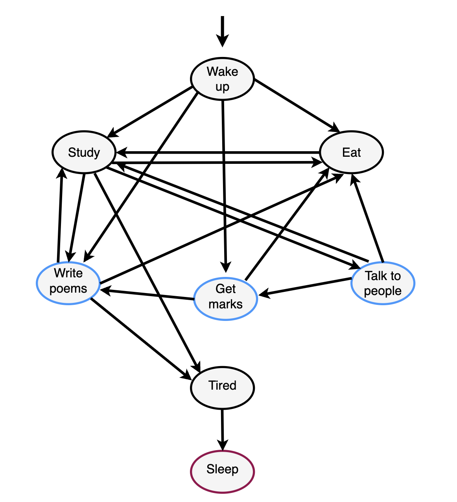

# lab_disc_3_ucu
Лабораторна робота №3 з предмету "Дискретна математика" 
Студентки І-ого курсу програми "Компʼютерні науки" УКУ Бабенко Аліни

Цей код реалізує простий кінцевий автомат, що представляє розпорядок дня студента ФПН (трошки творчого). Студент проходить через різні стани залежно від часу доби та певних випадкових подій. Стани включають пробудження, прийом їжі, навчання, отримання оцінок, написання віршів, спілкування з людьми, відчуття втоми та сон.

## Використання

Щоб використати цей код, виконайте такі дії:

1. Створіть екземпляр класу `State`: `state = State()`.
2. Згенеруйте день, викликавши метод `generate_day()`: `state.generate_day()`.
3. Надішліть вхідні дані кінцевому автомату за допомогою методу `send()`: `state.current_state.send(input)`. Вхідні дані можуть бути цілими числами, що представляють поточний час доби (наприклад, "7" для 7 ранку).
4. За потреби повторіть крок 3, щоб імітувати різні входи протягом дня.
5. Щоб зупинити симуляцію, надішліть вхід `None`: `state.current_state.send(None)`.

## Переходи стану

1. **Wake Up**: початковий стан. Переходить до стану `Eat`, якщо введено 7, 13 або 18. Переходить до `Study`, `Write poems` або `Get grades `випадковим чином на основі згенерованого випадкового числа.
2. **Eat**: переходить до `Study`, якщо введено 8, 14 або 19.
3. **Study**: збільшує `life_hard` на 10. Якщо `life_hard` перевищує 90, переходить до `Tired`. Переходить до `Eat`, якщо введено 13 або 18. Переходить до `Talk to people` або `Write poems` випадковим чином на основі згенерованого випадкового числа.
4. **Talk to people**: зменшує `life_hard` на 10. Переходить до `Study`, `Get grades` випадковим чином на основі згенерованого випадкового числа. Переходить до `Eat`, якщо введено 13 або 18.
5. **Get grades**: зменшує `life_hard` на 15. Переходить до `Write poems`, якщо випадкове число менше 0,8. Переходить до `Eat`, якщо введено 13 або 18.
6. **Write poems**: якщо `life_hard` перевищує 90, переходить до `Sleep`. Переходить до `Study`, якщо випадкове число менше 0,9. Переходить до `Eat`, якщо введено 13 або 18.
7. **Tired**: переходить до `Sleep`, якщо введено 23.
8. **Sleep**: Кінцевий стан.

## Приклад

Ось приклад використання коду:

state = State()
state.generate_day()
state.current_state.send(None)
state.current_state.send(7)

Це імітує день, який починається о 7 ранку, і генерує відповідний вихід на основі переходів станів.

Нижче надана діаграма, на основі якої був написаний код:

# Дякую за увагу!